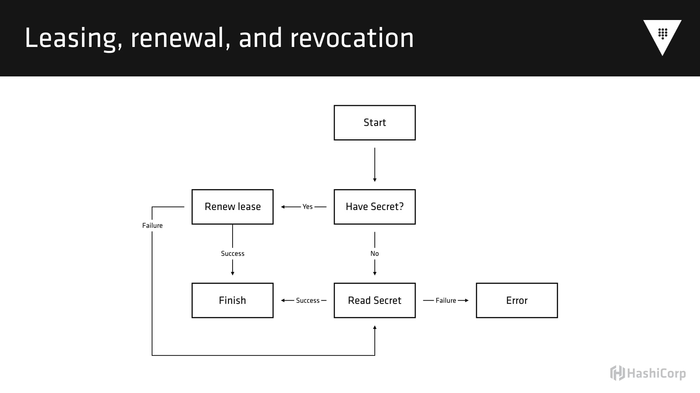
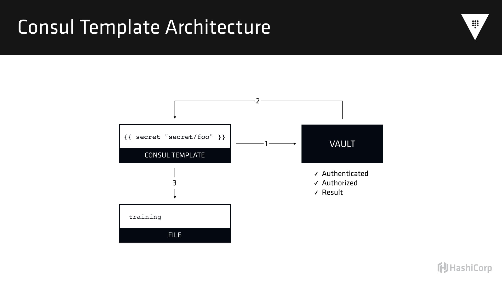

# Using Puppet with HashiCorp Vault (PuppetConf 2016)

This repository contains all the materials and a rough outline for [my talk at PuppetConf 2016](https://puppetconf2016.sched.org/event/6fjv/using-hashicorps-vault-with-puppet-seth-vargo-hashicorp) which discusses using Vault to manage secrets with Puppet.

This outline was written in advance of the presentation, so questions or digressions may not be captured here in the fullest. You should watch the video for the full context.

These configurations use Vault 0.6.2, but the concepts should be largely applicable to most Vault releases.

**These are _NOT_ best practices Terraform configurations or Vault setup. These are for demonstration purposes only and should not be used in production.**

## The Past
In order to talk about the future, it is often helpful to talk about the past. Assume you have a web application that requires a connection to a database.

If you are a startup, you just SSH into production, run some SQL commands, and generate a new login credential. If you work for a larger enterprise, you open a JIRA ticket, wait 6-8 weeks, then get the plain text credentials in an email that you copy-paste into your configuration management tool.

Because this process is so painful and so time consuming, you never rotate those credentials, and you probably keep a copy locally for yourself, just in case...

If you are a large enough enterprise, you are likely using a configuration management tool like CFEngine, Puppet, Chef, or Ansible. There are a few techniques for distributing these secrets to all required machines.

_Associated manifest files are generated by the user-data script in Terraform_

- **Directly in the manifest** - also known as YOLO-mode, you put the credential in plain text directly in the manifest file, check it into source control, and trust the SCM gods to keep it safe.

    ```shell
    $ cat direct.pp
    ```

    ```shell
    $ puppet apply direct.pp
    ```

    ```shell
    $ cat /tmp/database.yml
    ```

- **Directly in hiera data** - also known as masked-YOLO-mode, you write the credential in plain directly into the heira data and pull it at runtime. This is _slightly_ better than directly in the manifest because it allows for per-node configurations and centralizes the information. It is theoretically to put ACLs around this data.

    ```shell
    $ cat hiera.pp
    ```

    ```shell
    $ puppet apply hiera.pp
    ```

    ```shell
    $ cat /tmp/database.yml
    ```

- **Encrypted hiera data** - there is no direct way to do this in Puppet, but using eyaml and hiera-eyaml, it is possible to encrypt data stored in hiera and have individual nodes perform the decryption. This sounds great on the surface, but it opens a realm of new questions like "how do I distribute keys?", "how do I rotate keys?", and "how do revoke a credential?".

    ```shell
    $ cat hiera-encrypted.pp
    ```

    ```shell
    $ puppet apply hiera-encrypted.pp
    ```

    ```shell
    $ cat /tmp/database.yml
    ```

- **Node-obtained secrets** - use the node to acquire secrets using a tool like [Summon](http://conjurinc.github.io/summon/). To be honest, I spent a significant amount of time trying to get this to work and was unsuccessful. There are 50 layers of indirection and the tool does not provide any added benefits above encrypted hiera data.

    ```shell
    $ cat summon-conjur.pp
    ```

    ```shell
    $ puppet apply summon-conjur.pp
    ```

    ```shell
    $ cat /tmp/database.yml
    ```

## The Problems
One of the most glaring problems with all of these approaches is the involvement of humans. There are too many touch points. There are too many areas where information is disclosed to multiple parties. There is too much clicking, copying, and pasting. All of this can be automated.

Another problem is that runtime configuration is not (and should not) be the responsibility of configuration management tools. CM is really good at provisioning systems and keeping them up to date. However, their core architecture does not allow edge-triggered updates. Most CM tools operate at build time or run at a fixed interval in production. This means you are forced to wait until the next CM run to pick up configuration changes.

All the secret solutions lack a break-glass procedure - what do you do in the event of a data breach? How do you reduce the bleeding? Coupled with the previous problem of lack of edge-triggering, it could be hours before a change is propagated across production systems for a simple credential rotation.

Lastly, in all the examples above, the nodes are using the same secret. This is partly due to the cultural challenges in acquiring a new secret, but also due to the dynamic nature of applications. When operating in a container or scheduler-based infrastructure, it's not feasible to wait 6-8 weeks to launch a new application or scale horizontally. It is simply easier to use the same credential everywhere, but this is incredibly problematic. Not only does it create a single point of failure on that credential (if it is revoked, none of our applications can connect to the database), but it also means we lack a way to programmatically acquire secrets. Multiple humans are involved in what should be a completely automated process.

## The Solution
Let's forget about configuration management for a bit and focus on the human component. How can we automate the secret acquisition process? More importantly, how can we automate the secret acquisition process such that:

- DBAs still feel important and secure in their job
- The security team is happy with the rules and policies
- Applications (or nodes) can programmatically generate credentials
- Humans can get acquire credentials too

[HashiCorp Vault](https://www.vaultproject.io) solves these problems and many more!

- DBAs define the code and procedures for generating database users
- The security team authors or reviews the policies and authentications
- Applications authenticate to Vault and generate their own credentials
- Humans authenticate to Vault and generate their own credentials

But Vault supports more than just database credentials. Let's take a look.

## Getting Started

First we need to configure our local client to talk to the remote Vault server. I have already provisioned this server in advance using [Terraform](https://www.terraform.io/). We can do this by setting the `VAULT_ADDR` environment variable:

```shell
$ export VAULT_ADDR=https://vault.demo
```

This server is not designed to be a "best-practices" Vault server and is mostly designed for demonstrations such as this. It is not production ready. Please do not use this Vault setup in production - you will be on the front page of Hacker News defending yourself as to why you got hacked.

We can check the status of the Vault:

```shell
$ vault status
```

It looks like we are ready to go!

## Authenticating

The first thing we need to do is authenticate to the Vault. Because this Vault is completely unconfigured, we need to use the root token to get started. Normally this is an auto-generated UUID, but I cheated and made it "root" to make the demo easier.

```shell
$ vault auth root
Successfully authenticated! You are now logged in.
token: root
token_duration: 0
token_policies: [root]
```

There are other authentication mechanisms for Vault, including username-password, GitHub, LDAP, and more.

## Static Secrets

There are two kinds of secrets in Vault - static and dynamic. Dynamic secrets have enforced leases and usually expire after a short period of time. Static secrets are refresh intervals, but they do not expire unless explicitly removed.

The easiest way to think about static secrets is "encrypted redis" or "encrypted memcached". Vault exposes an encrypted key-value store such that all data written is encrypted and stored.

Let's go ahead and write, read, update, and delete some static secrets:

```shell
$ vault write secret/foo value=my-secret-value
Success! Data written to: secret/foo
```

```shell
$ vault read secret/foo
Key             	Value
---             	-----
refresh_interval	768h0m0s
value           	my-secret-value
```

```shell
$ vault write secret/foo value=new-secret author=sethvargo
Success! Data written to: secret/foo
```

```shell
$ vault read secret/foo
Key             	Value
---             	-----
refresh_interval	768h0m0s
author          	sethvargo
value           	new-secret
```

```shell
$ vault list secret/
Keys
----
foo
```

## Dynamic Secrets

While Vault can easily replace your existing K/V secret solution, its real power comes from the secret acquisition engine. Vault can act as the "root" user to many databases and services to dynamically generate sub-accounts based on policy. Let's take a look at Postgres, for example.

Most backends in Vault need to be mounted before use:

```shell
$ vault mount postgresql
Successfully mounted 'postgresql' at 'postgresql'!
```

Great - we just need to give Vault the connection URL to our Postgres database. Well it just so happens that a Postgres database is already installed and configured on this instance, so let's wire it up. The connection_url was written out by Terraform:

```shell
$ cat connection_url.txt
```

```shell
$ vault write postgresql/config/connection connection_url=@connection_url.txt
```

(This value comes from Terraform, since Terraform auto-generates the user for us.)

We get a warning back, but that is just telling us that the connection URL includes credentials, and we should be careful with our ACLs.

The default lease for these credentials is 30 days, but we want our credentials to be around much shorter. Let's set this to 24 hours:

```shell
$ vault write postgresql/config/lease lease=1h lease_max=24h
```

Now we have to create a "role" that will map to particular type of postgres user. (In postgres, users are called roles). This is super-annoying to type, but you only need to do it once! Yay! But I cheated and put it in a file.

Here is the SQL - the things between `{{ }}` get filled in by Vault automatically:

```shell
$ cat readonly.sql
...
```

We can tell Vault to read the contents of this file from disk using the `@` symbol:

```shell
$ vault write postgresql/roles/readonly sql=@readonly.sql
Success! Data written to: postgresql/roles/readonly
```

Now Vault is configured with the ability to dynamically generate postgres users on demand. We can generate new credentials by reading from the "creds" path with the name of the role.

```shell
$ vault read postgresql/creds/readonly
Key            	Value
---            	-----
lease_id       	postgresql/creds/readonly/537d2c8b-2739-3bb8-d23c-f0b6a0faccb7
lease_duration 	1h0m0s
lease_renewable	true
password       	1cc25c09-838f-3a80-95ef-d2d8af1a4bec
username       	token-bc05322c-0dd5-6f02-b843-80f12a834740
```

You may notice there is a lease duration associated with this credential, and its value is one hour. What happens after one hour? (Answer soon...)

Let's look at an example of how Puppet could programmatically acquire this secret.

```shell
$ cat vault-direct.pp
```

```shell
$ puppet apply vault-direct.pp
```

```
$ cat /tmp/database.json
{
  "username": "token-c01c6769-6c3f-5726-91d9-cfadc1b8168c",
  "password": "4e959c3e-3cd1-d2a8-1d78-bd03876f1113"
}
```

Earlier when we configured the lease duration, we specified that leases are valid for 1 hour and can be renewed for up to a total of 24 hours. That means the theoretical minimum lifetime of a credential is 1h and the maximum is 24h, unless revoked early.

In Vault's architecture, nodes and applications using credentials must renew those credentials before the lease duration expires. Failure to renew credentials before the lease expires results in the credential being revoked.



This means applications wishing to integrate with Vault must implement this control flow and credential renewal lifecycle. It is challenging to get this correct, and it requires a daemon-like process on the system. For this reason, configuration management probably is not the best place to manage this lifecycle. In particular, it would be impossible to have short-lived secrets under this model, because they would expire before the configuration management tool could renew them.

Fortunately applications do not need to implement this flow either. There are open source tools which exist to implement this control flow for you, making it transparent to your applications and configuration management tooling.



We can leverage Puppet to install, configure, setup, and start Consul Template for us. Once started, Consul Template will manage the renewal and revocation of the credentials. It will write out that destination file for us, and can optionally inform our application when it changes.

```shell
$ cat vault-ct.pp
```

```shell
$ sudo -i puppet apply /home/ubuntu/vault-ct.pp
```

Consul Template is now running and monitoring the node status:

```shell
$ sudo service consul-template status
```

And that process has logs:

```shell
$ sudo tail -f /var/log/upstart/consul-template.log
```

And the configuration file is being written:

```shell
$ cat /tmp/database.yml
---
production:
  adapter: postgresql
  database: myapp
  username: token-5ab7d1b0-0ceb-e299-686b-216fe95d6875
  password: c7e91466-ae19-65a4-d0b7-9a99a95464cf
```

This file is under management by Consul Template. Even though Puppet is not running on a set interval, Consul Template will monitor the secret, renew the secret, and handle transient failures.

## Benefits

Some of the benefits of this approach are:

- Configuration management is not responsible for securing secrets
- Nodes and applications acquire their own secrets without involving a human
- Secrets are easily revoked in the event of a data breech
